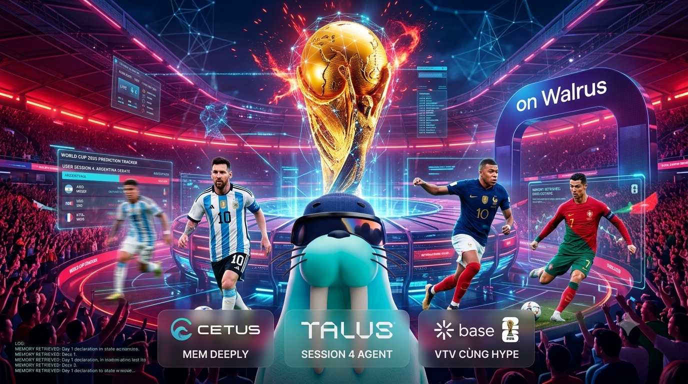

# HypeMan & DoomSayer

> Dual FIFA World Cup 2026 AI agents that remember every prediction, team loyalty, and emotional flip-flop — per user session — and roast or hype you on Day 4 using Walrus Memory.

**Walrus Sessions 4 — [Walrus Memory World Cup](https://thewalrussessions.wal.app/memory-world-cup/index.html)** submission by [Taybew1](https://github.com/Taybew1).

---

## Links

| Resource | URL |
|----------|-----|
| **Live demo** | _Deploy and add URL here_ |
| **GitHub** | https://github.com/Taybew1/Taybew-SS4 |
| **Demo video** (≤ 3 min) | _Add YouTube / Loom link_ |
| **MemWalAccount (SuiScan)** | https://suiscan.xyz/mainnet/object/0x31bd4294b5360ea1f5b4bc205493bad2edc97714e5bef612e6d2c28ae99e8627 |
| **Building docs** | [PLAN.md](./PLAN.md) · [BUILDING_INSTRUCTIONS.md](./BUILDING_INSTRUCTIONS.md) |
| **Submission form** | https://airtable.com/appoDAKpC74UOqoDa/shrIl2BMnzMwpuLhO |
| **DeepSurge** | Register at [deepsurge.xyz](https://deepsurge.xyz) |

---

## Overview

**HypeMan & DoomSayer** is a World Cup 2026 fan agent with two opposing personalities:

- **HypeMan** — your ride-or-die defender who amplifies loyalty and finds silver linings.
- **DoomSayer** — the brutal reality checker who pulls receipts from your past takes.

On **Day 1**, you declare a team or prediction (e.g. _"Argentina will win, Messi is eternal"_). The agent stores structured memory — favorite team, idol, vibe, and your exact Day 1 quote. On **Day 4+**, when you waver (_"I'm bored / I want to give up"_), both agents **change behavior** by recalling what you said on Day 1. That callback is impossible without persistent memory.

Memory is visible in the UI via the **Walrus Brain State** panel — not logs-only.



---

## Walrus Memory

This project uses **Walrus Memory** to power long-term, portable agent state tied to the user session:

| Memory slot | Purpose |
|-------------|---------|
| `favorite_team` | Team the user declared (e.g. Argentina) |
| `idol` | Player idol extracted from chat |
| `user_vibe` | Emotional profile (Confident, Exploring, …) |
| `day_1_declaration` | Verbatim Day 1 quote — used for Day 4 roast callbacks |
| `betting_history` | Simulated prediction streak for context |
| `win_rate` | Win percentage driving agent tone |

**Walrus usage (2–5 sentences for submission forms):**

> HypeMan & DoomSayer stores fan profile state in Walrus via MemWal, isolated per user namespace. Each chat turn reads structured memory (favorite team, Day 1 declaration, betting trend) before generating dual-agent responses. On Day 4, semantic recall of the user's original quote drives HypeMan's encouragement and DoomSayer's roast — behavior that cannot happen on Day 1. Structured state lives in JSON fields; the UI **Walrus Brain State** panel makes memory judge-visible in real time.

> **Current MVP:** the frontend uses an in-browser mock store for fast UI demos. **MemWalAccount is provisioned on mainnet** — follow [BUILDING_INSTRUCTIONS.md](./BUILDING_INSTRUCTIONS.md) to wire the serverless API and replace mock storage with real Walrus persistence.

---

## Memory Moment — Day 1 vs Day 4

Judges look for a genuine **before/after**: the agent on day one vs after sustained use.

| Session | User action | Agent behavior |
|---------|-------------|----------------|
| **Day 1** | _"I think Argentina will win World Cup 2026, Messi is eternal"_ | HypeMan praises; DoomSayer dismisses. Memory saves team, idol, and exact quote. |
| **Day 2–3** | General match chat | Agents reference stored win streak and favorite-chasing pattern from Walrus history. |
| **Day 4** | _"I'm bored / I want to give up / chán quá"_ | **HypeMan** cites Messi's 2022 Saudi loss comeback + your win streak. **DoomSayer** quotes your Day 1 declaration verbatim from Walrus logs and calls out bandwagon behavior. |

Use the **Timeline Simulator** slider (Day 1 → Day 4) in the left panel to reproduce this flow instantly during demo or video recording.

---

## Judge walkthrough (~60 seconds)

1. Open the **live demo URL** (or run locally — see below).
2. Sign in with **Google** (optional; session persists in browser).
3. Set timeline to **Day 1**. Send: _"I think Argentina will win World Cup 2026, Messi is eternal"_.
4. Confirm **Walrus Brain State** shows `[Fav_Team]: Argentina`, `[Day1_Quote]: "…"`.
5. Drag slider to **Day 4: Memory Explosion**.
6. Send: _"I'm bored, I don't want to watch anymore"_.
7. **HypeMan** references Messi / win streak; **DoomSayer** quotes your Day 1 line — memory-driven behavior change.
8. Refresh the page → state persists (portable memory within session).
9. _(Production)_ Link **MemWalAccount** on SuiScan for on-chain proof.

---

## Features

- Dual-agent chat UI (HypeMan + DoomSayer side by side)
- Visible **Walrus Brain State** ledger in the UI
- **Timeline Simulator** for Day 1–4 judge demos
- Google OAuth identity + session persistence
- World Cup 2026 themed UX (Tailwind CSS, responsive layout)
- Reset control to wipe memory state for clean demos

---

## Tech stack

- **Frontend:** HTML, Tailwind CSS (CDN), vanilla JavaScript
- **Auth:** Google Identity Services (OAuth)
- **Memory:** Walrus Memory / MemWal _(mainnet integration — see roadmap)_
- **Hosting:** Static deploy (Vercel, GitHub Pages, or any static host)

---

## Getting started

### Prerequisites

- A modern browser (Chrome, Firefox, Edge)
- Optional: Google Cloud OAuth Client ID for your deploy domain

### Run locally

```bash
git clone https://github.com/Taybew1/Taybew-SS4.git
cd Taybew-SS4

# Serve static files (pick one)
npx serve .
# or
python -m http.server 8080
```

Open `http://localhost:8080` (or the port shown), then follow the [Judge walkthrough](#judge-walkthrough-60-seconds).

### Google OAuth (production)

1. Create a project in [Google Cloud Console](https://console.cloud.google.com/).
2. Enable **Google Identity Services** and add your deploy origin to authorized JavaScript origins.
3. Replace `GOOGLE_CLIENT_ID` in `app.js` with your Client ID.

---

## Deployment

Deploy the repo root as a **static site** (no build step):

| Platform | Steps |
|----------|--------|
| **Vercel** | Import repo → Framework: Other → Deploy |
| **GitHub Pages** | Settings → Pages → Deploy from `main` branch |

After deploy, add the production URL to this README and to the [Airtable submission form](https://airtable.com/appoDAKpC74UOqoDa/shrIl2BMnzMwpuLhO).

---

## Hackathon submission checklist

Per [official event rules](https://thewalrussessions.wal.app/memory-world-cup/index.html):

- [ ] Public production URL (no clone required)
- [ ] MemWal mainnet + MemWalAccount explorer link
- [ ] Memory visible in UI (Walrus Brain State panel)
- [ ] 2–5 sentence Walrus usage blurb _(see above)_
- [ ] Core capability: **Long-Term Memory** — Day 1 quote recalled on Day 4
- [ ] Demo video ≤ 3 minutes (Memory Moment included)
- [ ] Deploy on **Walrus Mainnet**; dedicated Sessions wallet address
- [ ] Complete [Walrus Memory feedback form](https://airtable.com/appoDAKpC74UOqoDa/shrIl2BMnzMwpuLhO) + optional MemWal GitHub issues
- [ ] Register on **DeepSurge** with project on mainnet
- [ ] Join [Walrus Discord](https://discord.com/invite/walrusprotocol)
- [ ] Post demo / screenshot with **#Walrus** on X

**Hackathon dates:** June 5 – June 24, 2026 · Results: July 2, 2026

---

## What sets this apart

1. **Memory drives the product** — Day 4 roasts literally quote Day 1; not a bolt-on chat log.
2. **Dual personality** — same memory, two opposing interpretations (hype vs doom).
3. **Judge-friendly timeline** — simulate 4 days in one session for demo video.
4. **Visible ledger** — Walrus Brain State panel shows structured memory slots live.
5. **World Cup 2026 hook** — predictions, loyalty, and bandwagon drama as the narrative frame.

---

## Project structure

```
Taybew-SS4/
├── index.html                  # App shell, chat UI, timeline simulator
├── app.js                      # Agent logic, memory state, Google auth
├── SS4.png                     # Banner asset
├── README.md                   # Project face + judge walkthrough
├── PLAN.md                     # Phased development plan
├── BUILDING_INSTRUCTIONS.md    # Setup, MemWal wiring, deploy
├── .env.example                # Env template (no secrets)
└── .gitignore
```

---

## Roadmap

See [PLAN.md](./PLAN.md) for full phases. Summary:

- [x] MemWalAccount on mainnet (`0x31bd…e8627`)
- [ ] Serverless API + MemWal SDK integration
- [ ] Replace in-browser mock store with Walrus read/write
- [ ] Production deploy + live demo URL
- [ ] Record ≤ 3 min demo video with Memory Moment
- [ ] Submit DeepSurge + Airtable + #Walrus post

---

## Team & contact

- **GitHub:** [@Taybew1](https://github.com/Taybew1)
- **Primary contact:** _Add email or Discord handle_

---

## License

MIT — see repository for details.

---

<p align="center">
  <strong>Walrus Sessions 4 · Walrus Memory World Cup · FIFA World Cup 2026</strong><br>
  Built with ⚽ for the Walrus Foundation hackathon
</p>
